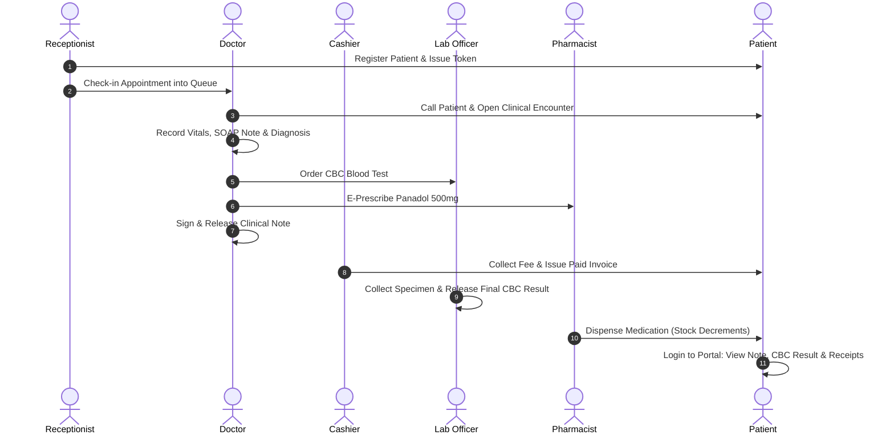

# WonFlow Healthcare Management System — Complete Manual Testing & Credentials Guide

This guide provides a complete manual testing protocol for the WonFlow Hospital & Tenant Management System. It contains all pre-seeded credentials, instructions for generating new credentials, and structured step-by-step test execution tables for every module and role.

---

## 1. System Overview & Pre-Seeded Master Credentials

- **Web Application URL:** `http://localhost:3007`
- **Default Master Password (All Seed Accounts):** `WonFlowDemo2026!`
- **Default Tenant Slug:** `wonflow-development`
- **Default Organization / Branch:** `WonFlow Development Hospital` / `Main Hospital (MAIN)`

### Pre-Seeded Accounts Master Matrix

| # | Workspace / Role | Email / Username | Password | Default Portal URL | Primary Purpose |
|---|---|---|---|---|---|
| **1** | **Super / Platform Admin** | `platform@wonflow.local` | `WonFlowDemo2026!` | [`/platform`](http://localhost:3007/platform) | Multi-tenant governance, tenant provisioning, subscriptions, system audit logs |
| **2** | **Hospital Tenant Admin** | `admin@wonflow.local` | `WonFlowDemo2026!` | [`/admin`](http://localhost:3007/admin) | Hospital config, branches, services catalogue, doctor sittings, staff invitations & roles |
| **3** | **Reception & Front Desk** | `reception@wonflow.local` | `WonFlowDemo2026!` | [`/operations/reception`](http://localhost:3007/operations/reception) | Patient registration, appointment scheduling, queue management, front-desk fee collection |
| **4** | **Lead Doctor (Senior)** | `doctor@wonflow.local` | `WonFlowDemo2026!` | [`/doctor`](http://localhost:3007/doctor) | Clinical consultation, SOAP notes, orders (Lab/Radiology), e-prescriptions, self-signing notes |
| **5** | **Supervised Doctor (Junior)** | `supervised-doctor@wonflow.local` | `WonFlowDemo2026!` | [`/doctor`](http://localhost:3007/doctor) | Clinical documentation requiring supervisor countersignature before release |
| **6** | **Cardiology Doctor** | `doctor.cardio@wonflow.local` | `WonFlowDemo2026!` | [`/doctor`](http://localhost:3007/doctor) | Specialized Cardiology clinic & online video consultations |
| **7** | **Paediatrics Doctor** | `doctor.pedia@wonflow.local` | `WonFlowDemo2026!` | [`/doctor`](http://localhost:3007/doctor) | Specialized Paediatric clinic consultations |
| **8** | **Orthopaedics Doctor** | `doctor.ortho@wonflow.local` | `WonFlowDemo2026!` | [`/doctor`](http://localhost:3007/doctor) | Specialized Orthopaedic clinic consultations |
| **9** | **Laboratory Officer** | `laboratory@wonflow.local` | `WonFlowDemo2026!` | [`/operations/laboratory`](http://localhost:3007/operations/laboratory) | Diagnostics worklist, specimen collection, lab result entry, validation, release |
| **10** | **Radiology Officer** | `radiology@wonflow.local` | `WonFlowDemo2026!` | [`/operations/radiology`](http://localhost:3007/operations/radiology) | Imaging worklist, diagnostic reporting, findings release |
| **11** | **Pharmacy & Dispensary** | `pharmacy@wonflow.local` | `WonFlowDemo2026!` | [`/operations/pharmacy`](http://localhost:3007/operations/pharmacy) | Prescription queue, stock batch dispensing, inventory management, purchase receipts |
| **12** | **Billing & Cashier** | `billing@wonflow.local` | `WonFlowDemo2026!` | [`/operations/billing/new`](http://localhost:3007/operations/billing/new) | Invoicing, fee collection, POS payment receipts, refunds, financial ledger |
| **13** | **Hospital Executive** | `management@wonflow.local` | `WonFlowDemo2026!` | [`/management`](http://localhost:3007/management) | Executive analytics, occupancy KPIs, financial reports, department trends |
| **14** | **Patient Portal** | `patient@wonflow.local` | `WonFlowDemo2026!` | [`/patient`](http://localhost:3007/patient) | Patient dashboard, appointments, video calls, released lab reports, invoices, messaging |

---

## 2. How to Create Next Credentials & New Entities

### A. How to Create a New Hospital Tenant (Super Admin)
1. Sign in with `platform@wonflow.local` at [`/login`](http://localhost:3007/login).
2. Navigate to [`/platform/organizations/new`](http://localhost:3007/platform/organizations/new).
3. Fill in:
   - **Hospital / Organization Name**: e.g., `City Care General Hospital`
   - **Tenant Slug**: e.g., `city-care` (this becomes the unique subdomain / identifier)
   - **Primary Admin Email**: e.g., `admin@citycare.local`
   - **Entitlements / Modules**: Enable Clinical, Pharmacy, Diagnostics, Telehealth.
4. Click **Create Organization**.
5. The system automatically creates the organization, initializes default branches (`MAIN`), seeds default workspace roles, and issues the Administrator credentials.

### B. How to Invite New Staff & Generate Custom Credentials (Hospital Admin)
1. Sign in with `admin@wonflow.local` at [`/login`](http://localhost:3007/login).
2. Navigate to [`/admin/team`](http://localhost:3007/admin/team) or [`/admin/users`](http://localhost:3007/admin/users).
3. Click the **"Invite Staff Member"** / **"Add User"** button.
4. Fill in the modal details:
   - **Full Name**: e.g., `Dr. Zarrar Farooq` or `Nurse Ayla Khan`
   - **Email**: e.g., `dr.zarrar@wonflow.local`
   - **Role / Workspace**: Select `DOCTOR`, `RECEPTION`, `LABORATORY`, `RADIOLOGY`, `PHARMACY`, `BILLING`, or `MANAGEMENT`.
   - **Department**: (If Doctor) Select `Cardiology`, `General Medicine`, etc.
   - **Assigned Branch**: Select `Main Hospital`.
5. Submit the form.
6. The system displays a dialog with the **Temporary Password** and **Direct Login Link**.
7. *To Reset an Existing User's Password*: In [`/admin/team`](http://localhost:3007/admin/team), locate the staff member and click **Reset Password**.

### C. How to Register & Create Patient Credentials
- **Method 1: Reception Desk Walk-In Registration**:
  1. Sign in as `reception@wonflow.local` and go to [`/operations/patients/register`](http://localhost:3007/operations/patients/register).
  2. Input Given Name, Family Name, Phone Number (`+92300...`), Email Address, and Gender.
  3. Toggle **"Enable Patient Portal Access"** (or use the registered email to sign in with the default password).
- **Method 2: Doctor Direct Admission**:
  1. Sign in as `doctor@wonflow.local` and go to [`/doctor/register-patient`](http://localhost:3007/doctor/register-patient).
  2. Complete the patient demographics form to create the medical record.
- **Method 3: Public Self-Service Booking**:
  1. Navigate to [`/book/wonflow-development`](http://localhost:3007/book/wonflow-development) without logging in.
  2. Select Doctor, Date, and Time Slot, then enter contact information.

---

## 3. Step-by-Step Manual Test Protocol Tables

### Test Suite 1: Platform Super Admin (`platform@wonflow.local`)

| Step | Action | URL / Navigation | Test Input / Details | Expected Result | Status |
|---|---|---|---|---|---|
| **1.1** | Sign in as Super Admin | `/login` | `platform@wonflow.local` / `WonFlowDemo2026!` | Redirects to `/platform` dashboard with system-wide analytics | [ ] Pass |
| **1.2** | View Hospital Tenants | `/platform/organizations` | Click "Organizations" | Lists all tenants including `wonflow-development` | [ ] Pass |
| **1.3** | Provision New Tenant | `/platform/organizations/new` | Name: `Apex Hospital`, Slug: `apex-hms`, Admin: `admin@apex.local` | Tenant is created with active status and initial roles | [ ] Pass |
| **1.4** | Check Subscriptions | `/platform/subscriptions` | Click "Subscriptions" | Displays module entitlements and active license tiers | [ ] Pass |
| **1.5** | Inspect System Audit Logs | `/platform/audit` | Click "Audit Logs" | Displays immutable audit records of all tenant operations | [ ] Pass |

---

### Test Suite 2: Hospital Tenant Admin (`admin@wonflow.local`)

| Step | Action | URL / Navigation | Test Input / Details | Expected Result | Status |
|---|---|---|---|---|---|
| **2.1** | Hospital Admin Overview | `/admin` | Login as `admin@wonflow.local` | Shows hospital operational summary and configuration shortcuts | [ ] Pass |
| **2.2** | Manage Locations & Branches | `/admin/locations` | Add Branch or edit `Main Hospital` | Branch details update without errors | [ ] Pass |
| **2.3** | Configure Services & Pricing | `/admin/services` | View `DEV-OPD-CONSULT` & `DEV-ONLINE-CONSULT` | Shows consultation durations, PKR fees, and active toggle | [ ] Pass |
| **2.4** | Doctor Rostering & Sittings | `/admin/schedules` | Inspect Dr. Ayesha Rahman's sitting roster | Shows 09:00–17:00 OPD schedule and room assignment | [ ] Pass |
| **2.5** | Staff Team Management | `/admin/team` | Click "Invite Staff Member" | Can invite new doctor/receptionist and receive issued credentials | [ ] Pass |

---

### Test Suite 3: Reception Desk & Patient Intake (`reception@wonflow.local`)

| Step | Action | URL / Navigation | Test Input / Details | Expected Result | Status |
|---|---|---|---|---|---|
| **3.1** | Reception Dashboard | `/operations/reception` | Login as `reception@wonflow.local` | Displays today's live queue, quick actions, and doctor roster | [ ] Pass |
| **3.2** | Register New Patient | `/operations/patients/register` | Name: `Muhammad Tariq Khan`, Phone: `03008451234`, Sex: Male | Patient record is created with MRN `DEV-0xxx` | [ ] Pass |
| **3.3** | Patient Search | `/operations/patients` | Search `Tariq` or `DEV-0001` | Matching patient profile appears immediately | [ ] Pass |
| **3.4** | Book Outpatient Appointment | `/operations/appointments/new` | Select Patient `DEV-0001`, Dr. Ayesha Rahman, Today's date | Appointment is booked; shows on daily schedule | [ ] Pass |
| **3.5** | Check-in & Queue Generation | `/operations/reception` | Click "Check-in" on booked appointment | Patient enters the queue, assigned a Token Number (e.g. #4) | [ ] Pass |

---

### Test Suite 4: Doctor Workspace & Clinical Care (`doctor@wonflow.local`)

| Step | Action | URL / Navigation | Test Input / Details | Expected Result | Status |
|---|---|---|---|---|---|
| **4.1** | Doctor Workspace | `/doctor` | Login as `doctor@wonflow.local` | Shows queue metrics, active patients, and pending encounters | [ ] Pass |
| **4.2** | Call Patient from Queue | `/doctor/consultations` | Click "Call Next Patient" | Patient status transitions from `WAITING` to `CALLED` | [ ] Pass |
| **4.3** | Start Clinical Encounter | `/doctor/consultations` | Open active encounter for `DEV-0001` | Opens clinical documentation workspace (SOAP, Vitals, Rx) | [ ] Pass |
| **4.4** | Record Vitals & SOAP Note | Active Encounter Page | BP: `120/80`, Pulse: `74`, Subjective: `Persistent cough 3 weeks` | Autosaves clinical note in draft mode | [ ] Pass |
| **4.5** | Order Diagnostic Tests | Active Encounter Page | Order `CBC (Complete Blood Count)` & `Chest X-Ray` | Orders are created and sent to Lab & Radiology worklists | [ ] Pass |
| **4.6** | Issue E-Prescription | Active Encounter Page | Prescribe `Panadol (Paracetamol 500mg)`: 1 tab TDS for 5 days | Prescription creates with `ACTIVE` status for Pharmacy | [ ] Pass |
| **4.7** | Sign & Release Note | Active Encounter Page | Click "Sign & Release Encounter" | Note is finalized; immediately viewable in Patient Portal | [ ] Pass |
| **4.8** | Countersignature Flow | Sign in as `supervised-doctor@wonflow.local` | Write note and click "Submit for Countersignature" | Note locks; senior `doctor@wonflow.local` approves it in `/doctor/countersignatures` | [ ] Pass |

---

### Test Suite 5: Billing & Cashier Desk (`billing@wonflow.local`)

| Step | Action | URL / Navigation | Test Input / Details | Expected Result | Status |
|---|---|---|---|---|---|
| **5.1** | Billing Counter Overview | `/operations/billing` | Login as `billing@wonflow.local` | Displays issued invoices, daily collection total, and unpaid bills | [ ] Pass |
| **5.2** | Create New Patient Invoice | `/operations/billing/new` | Patient: `DEV-0001`, Line Item: Consultation Fee PKR 1,500 | Generates invoice `DEV-INV-xxxxx` in `ISSUED` status | [ ] Pass |
| **5.3** | Collect & Record Payment | In Invoice details | Method: `Cash`, Amount: `1500`, Reference: `REC-01` | Invoice transitions to `PAID`; payment receipt is generated | [ ] Pass |
| **5.4** | Patient Ledger Statement | `/operations/patients/[patientId]/billing/statement` | Open statement for `DEV-0001` | Displays full transactional history and zero outstanding balance | [ ] Pass |
| **5.5** | Refund Processing | `/operations/billing/refunds` | Select refundable transaction, enter reason | Issues credit note/refund and updates audit trail | [ ] Pass |

---

### Test Suite 6: Laboratory Department (`laboratory@wonflow.local`)

| Step | Action | URL / Navigation | Test Input / Details | Expected Result | Status |
|---|---|---|---|---|---|
| **6.1** | Laboratory Worklist | `/operations/laboratory` | Login as `laboratory@wonflow.local` | Shows pending lab test orders placed by doctors | [ ] Pass |
| **6.2** | Specimen Collection | `/operations/laboratory/collection` | Select CBC test order, click "Collect Specimen" | Order status advances to `SPECIMEN_COLLECTED` | [ ] Pass |
| **6.3** | Enter Lab Results | `/operations/laboratory/results/[orderId]` | Hb: `13.5 g/dL`, WBC: `7.5 x10^9/L`, Platelets: `250 x10^9/L` | Result values saved and marked for verification | [ ] Pass |
| **6.4** | Verify & Release Lab Report | `/operations/laboratory/release` | Click "Verify & Release Report" | Report status is `FINAL`; immediately visible to Doctor & Patient | [ ] Pass |
| **6.5** | Critical Value Alert | `/operations/laboratory/critical` | Enter panic value (e.g. Troponin-I `4.5 ng/mL`) | Flags urgent visual alert across doctor's clinical inbox | [ ] Pass |

---

### Test Suite 7: Radiology & Imaging (`radiology@wonflow.local`)

| Step | Action | URL / Navigation | Test Input / Details | Expected Result | Status |
|---|---|---|---|---|---|
| **7.1** | Radiology Worklist | `/operations/radiology` | Login as `radiology@wonflow.local` | Displays pending imaging orders (X-Ray, Ultrasound, CT) | [ ] Pass |
| **7.2** | Procedure In-Progress | `/operations/radiology/processing` | Select Chest X-Ray order, mark "Examination Started" | Order status changes to `IN_PROGRESS` | [ ] Pass |
| **7.3** | Enter Diagnostic Findings | `/operations/radiology/results/[orderId]` | Findings: `Normal cardiac silhouette. No focal consolidation.` | Drafts the radiology narrative report | [ ] Pass |
| **7.4** | Release Radiology Report | `/operations/radiology/release` | Click "Sign & Release Imaging Report" | Final imaging report is released to patient and ordering doctor | [ ] Pass |

---

### Test Suite 8: Pharmacy & Inventory (`pharmacy@wonflow.local`)

| Step | Action | URL / Navigation | Test Input / Details | Expected Result | Status |
|---|---|---|---|---|---|
| **8.1** | Prescription Queue | `/operations/pharmacy` | Login as `pharmacy@wonflow.local` | Displays active e-prescriptions ordered by doctors | [ ] Pass |
| **8.2** | Dispense Prescription | `/operations/pharmacy` | Select Panadol Rx -> Select Batch `BATCH-MED-PARA-500-A` (Qty: 10) | Prescription status changes to `DISPENSED` | [ ] Pass |
| **8.3** | Verify Stock Decrement | `/operations/pharmacy/inventory` | Check quantity of `BATCH-MED-PARA-500-A` | Inventory stock decreases by exactly 10 units | [ ] Pass |
| **8.4** | Inventory Expiry Tracking | `/operations/pharmacy/inventory` | Inspect near-expiry items (Batch B) | Flags warning badge for stock expiring within 30 days | [ ] Pass |
| **8.5** | Medication Return | `/operations/pharmacy/returns` | Record patient returned unconsumed sealed strip | Restores quantity into quarantine/active inventory | [ ] Pass |

---

### Test Suite 9: Patient Portal & Telehealth (`patient@wonflow.local`)

| Step | Action | URL / Navigation | Test Input / Details | Expected Result | Status |
|---|---|---|---|---|---|
| **9.1** | Patient Home Dashboard | `/patient` | Login as `patient@wonflow.local` | Shows upcoming visits, recent clinical summaries, and notifications | [ ] Pass |
| **9.2** | Book Appointment Online | `/patient/appointments/book` | Select General Medicine -> Select Dr. Ayesha Rahman -> Pick Slot | Appointment is confirmed and token is assigned | [ ] Pass |
| **9.3** | Join Live Video Consultation | `/patient/appointments/[id]/video` | Open live online appointment slot | WebRTC video room connects; doctor and patient can communicate | [ ] Pass |
| **9.4** | View Released Lab/Radiology Results | `/patient/documents` | Check released CBC and Chest X-Ray reports | Displays downloadable/viewable diagnostic test reports | [ ] Pass |
| **9.5** | View Invoices & Receipts | `/patient/billing` | Check invoice history | Shows paid receipts and outstanding balance items | [ ] Pass |
| **9.6** | Direct Clinical Messaging | `/patient/messages` | Send message to care team | Care team receives inquiry in doctor inbox | [ ] Pass |

---

### Test Suite 10: Security & RBAC Boundary Enforcement

Verify that least-privilege role boundaries are strictly enforced at both the API and UI levels:

| Role Tested | Route Tested | Expected HTTP Status | Expected UI Behavior | Status |
|---|---|---|---|---|
| `patient@wonflow.local` | `/doctor` or `/api/v1/doctor/dashboard` | **403 Forbidden** | Refuses access; redirects or displays permission denied | [ ] Pass |
| `patient@wonflow.local` | `/admin` or `/api/v1/admin/users` | **403 Forbidden** | Refuses access; no staff or organizational data leaks | [ ] Pass |
| `reception@wonflow.local` | `/api/v1/pharmacy/inventory` | **403 Forbidden** | Denied access to pharmacy inventory writes | [ ] Pass |
| `doctor@wonflow.local` | `/api/v1/admin/users` | **403 Forbidden** | Denied access to hospital administrator user controls | [ ] Pass |
| `laboratory@wonflow.local` | `/api/v1/billing/invoices` | **403 Forbidden** | Denied access to financial and cashier ledger | [ ] Pass |
| `billing@wonflow.local` | `/api/v1/pharmacy/inventory` | **403 Forbidden** | Denied access to pharmacy inventory batch modifications | [ ] Pass |
| `admin@wonflow.local` | `/api/v1/platform/organizations` | **403 Forbidden** | Denied access to Super Admin platform management | [ ] Pass |

---

## 4. End-to-End Golden Clinical Journey (Interactive 10-Minute Walkthrough)

To experience the complete flow in real-time, open two separate browser windows (or one standard window and one Incognito window):



### Detailed Golden Journey Steps:
1. **Window 1 (Reception):** Sign in as `reception@wonflow.local`. Go to `/operations/patients/register`, register a new patient, and book an appointment with Dr. Ayesha Rahman. Check in the patient into the live queue.
2. **Window 2 (Doctor):** Sign in as `doctor@wonflow.local`. Go to `/doctor/consultations`. You will see the patient in the queue. Click **Call Patient**, start the encounter, record blood pressure, order a `CBC` test, and prescribe `Panadol`. Click **Sign & Release**.
3. **Window 1 (Billing):** Sign in as `billing@wonflow.local`. Go to `/operations/billing`. Locate the patient's invoice, record a cash payment, and print the receipt.
4. **Window 1 (Laboratory):** Sign in as `laboratory@wonflow.local`. Go to `/operations/laboratory`. The CBC order appears on the worklist. Collect sample, enter normal haemoglobin values, and click **Release Report**.
5. **Window 1 (Pharmacy):** Sign in as `pharmacy@wonflow.local`. Go to `/operations/pharmacy`. The Panadol prescription is visible. Select batch and click **Dispense**. Observe stock reduction in `/operations/pharmacy/inventory`.
6. **Window 2 (Patient Portal):** Sign in as `patient@wonflow.local`. Go to `/patient`. View the released clinical note, the verified CBC lab report, and the paid billing receipts.

---

## 5. Maintenance & Reset Commands

If at any point you want to reset your local database back to a clean, known demo state, run:

```bash
# 1. Reset and re-seed all master development logins and core permissions
pnpm db:seed:dev

# 2. Populate complete operational demo data (sittings, inventory, patients, queue)
pnpm db:seed:demo

# 3. Start local development server
pnpm dev
```

All credentials and scenarios will immediately be restored and ready for testing.
